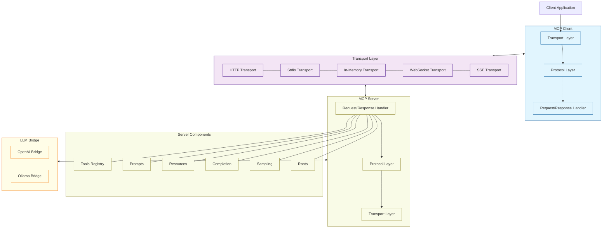

```mermaid
flowchart TD
    Client["Client Application"] --> ClientTransport
    
    subgraph MCP_Client["MCP Client"]
        ClientTransport["Transport Layer"]
        ClientProtocol["Protocol Layer"]
        ClientHandler["Request/Response Handler"]
        
        ClientTransport --> ClientProtocol
        ClientProtocol --> ClientHandler
    end
    
    subgraph Transports["Transport Layer"]
        direction LR
        HTTP["HTTP Transport"]
        Stdio["Stdio Transport"]
        InMemory["In-Memory Transport"]
        WS["WebSocket Transport"]
        SSE["SSE Transport"]
        
        HTTP --- Stdio
        Stdio --- InMemory
        InMemory --- WS
        WS --- SSE
    end
    
    subgraph MCP_Server["MCP Server"]
        ServerHandler["Request/Response Handler"]
        ServerProtocol["Protocol Layer"]
        ServerTransport["Transport Layer"]
        
        ServerHandler --> ServerProtocol
        ServerProtocol --> ServerTransport
    end
    
    subgraph Server_Components["Server Components"]
        Tools["Tools Registry"]
        Prompts["Prompts"]
        Resources["Resources"]
        Completion["Completion"]
        Sampling["Sampling"]
        Roots["Roots"]
        
        ServerHandler --- Tools
        ServerHandler --- Prompts
        ServerHandler --- Resources
        ServerHandler --- Completion
        ServerHandler --- Sampling
        ServerHandler --- Roots
    end
    
    subgraph LLM_Bridge["LLM Bridge"]
        OpenAI["OpenAI Bridge"]
        Ollama["Ollama Bridge"]
    end
    
    MCP_Client <--> Transports
    Transports <--> MCP_Server
    MCP_Server <--> LLM_Bridge
    
    classDef client fill:#e1f5fe,stroke:#01579b
    classDef server fill:#f9fbe7,stroke:#827717
    classDef transport fill:#f3e5f5,stroke:#4a148c
    classDef bridge fill:#fffde7,stroke:#f57f17
    
    class MCP_Client,ClientTransport,ClientProtocol,ClientHandler client
    class MCP_Server,ServerHandler,ServerProtocol,ServerTransport,Server_Components,Tools,Prompts,Resources,Completion,Sampling,Roots server
    class Transports,HTTP,Stdio,InMemory,WS,SSE transport
    class LLM_Bridge,OpenAI,Ollama bridge
```
