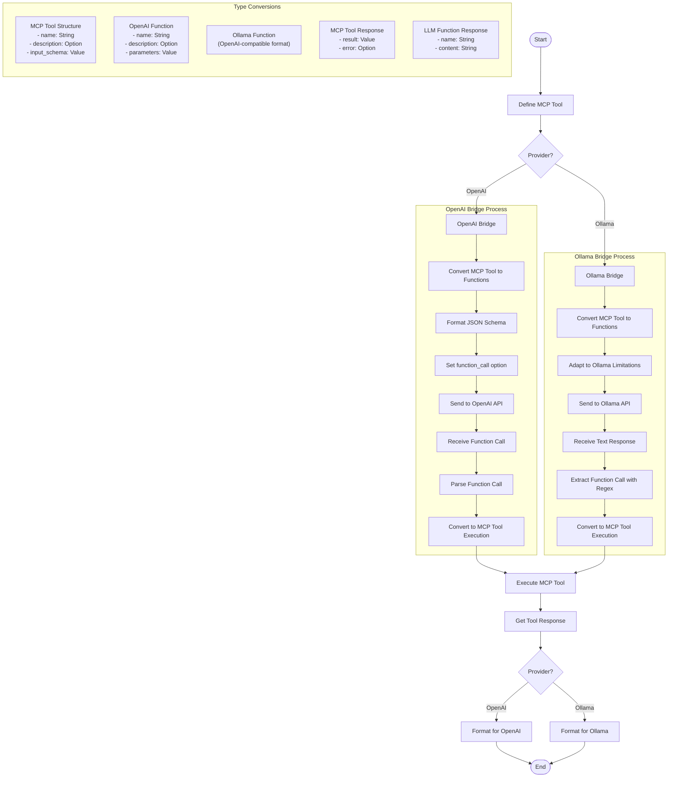

```mermaid
flowchart TD
    Start([Start]) --> ToolDef[Define MCP Tool]
    ToolDef --> BridgeProvider{Provider?}
    
    BridgeProvider -->|OpenAI| OpenAIBridge[OpenAI Bridge]
    BridgeProvider -->|Ollama| OllamaBridge[Ollama Bridge]
    
    subgraph OpenAI Bridge Process
        direction TB
        OpenAIBridge --> ConvertOpenAI[Convert MCP Tool to Functions]
        ConvertOpenAI --> FormatOpenAISchema[Format JSON Schema]
        FormatOpenAISchema --> SetFunctionCall[Set function_call option]
        SetFunctionCall --> SendToOpenAI[Send to OpenAI API]
        SendToOpenAI --> ReceiveOpenAIResponse[Receive Function Call]
        ReceiveOpenAIResponse --> ParseOpenAIResponse[Parse Function Call]
        ParseOpenAIResponse --> ConvertToMCPExecution[Convert to MCP Tool Execution]
    end
    
    subgraph Ollama Bridge Process
        direction TB
        OllamaBridge --> ConvertOllama[Convert MCP Tool to Functions]
        ConvertOllama --> AdaptForOllama[Adapt to Ollama Limitations]
        AdaptForOllama --> SendToOllama[Send to Ollama API]
        SendToOllama --> ReceiveOllamaResponse[Receive Text Response]
        ReceiveOllamaResponse --> ExtractFunctionCall[Extract Function Call with Regex]
        ExtractFunctionCall --> ConvertToMCPExecution2[Convert to MCP Tool Execution]
    end
    
    ConvertToMCPExecution --> ExecuteTool[Execute MCP Tool]
    ConvertToMCPExecution2 --> ExecuteTool
    
    ExecuteTool --> ToolResponse[Get Tool Response]
    ToolResponse --> BridgeResponseProvider{Provider?}
    
    BridgeResponseProvider -->|OpenAI| FormatOpenAIResponse[Format for OpenAI]
    BridgeResponseProvider -->|Ollama| FormatOllamaResponse[Format for Ollama]
    
    FormatOpenAIResponse --> End([End])
    FormatOllamaResponse --> End
    
    subgraph Type Conversions
        direction TB
        MCPTool["MCP Tool Structure\n- name: String\n- description: Option<String>\n- input_schema: Value"]
        OpenAIFunction["OpenAI Function\n- name: String\n- description: Option<String>\n- parameters: Value"]
        OllamaFunction["Ollama Function\n(OpenAI-compatible format)"]
        
        MCPResponse["MCP Tool Response\n- result: Value\n- error: Option<String>"]
        LLMResponse["LLM Function Response\n- name: String\n- content: String"]
    end
```
