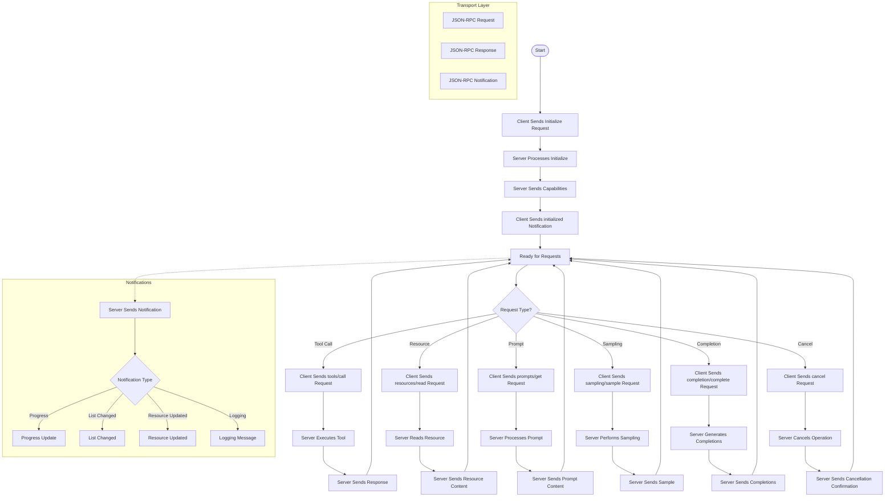

```mermaid
flowchart TD
    Start([Start]) --> ClientInit[Client Sends Initialize Request]
    ClientInit --> ServerInit[Server Processes Initialize]
    ServerInit --> SendCapabilities[Server Sends Capabilities]
    SendCapabilities --> ClientNotify[Client Sends initialized Notification]
    ClientNotify --> Ready[Ready for Requests]
    
    Ready --> ToolReq{Request Type?}
    
    ToolReq -->|Tool Call| ToolRequest[Client Sends tools/call Request]
    ToolRequest --> ToolExecute[Server Executes Tool]
    ToolExecute --> ToolResponse[Server Sends Response]
    ToolResponse --> Ready
    
    ToolReq -->|Resource| ResourceRequest[Client Sends resources/read Request]
    ResourceRequest --> ResourceRead[Server Reads Resource]
    ResourceRead --> ResourceResponse[Server Sends Resource Content]
    ResourceResponse --> Ready
    
    ToolReq -->|Prompt| PromptRequest[Client Sends prompts/get Request]
    PromptRequest --> PromptProcess[Server Processes Prompt]
    PromptProcess --> PromptResponse[Server Sends Prompt Content]
    PromptResponse --> Ready
    
    ToolReq -->|Sampling| SamplingRequest[Client Sends sampling/sample Request]
    SamplingRequest --> ModelSample[Server Performs Sampling]
    ModelSample --> SamplingResponse[Server Sends Sample]
    SamplingResponse --> Ready
    
    ToolReq -->|Completion| CompletionRequest[Client Sends completion/complete Request]
    CompletionRequest --> Completions[Server Generates Completions]
    Completions --> CompletionResponse[Server Sends Completions]
    CompletionResponse --> Ready
    
    ToolReq -->|Cancel| CancelRequest[Client Sends cancel Request]
    CancelRequest --> CancelOperation[Server Cancels Operation]
    CancelOperation --> CancelResponse[Server Sends Cancellation Confirmation]
    CancelResponse --> Ready
    
    subgraph Notifications
        direction TB
        ServerNotify[Server Sends Notification]
        ServerNotify --> NotifyType{Notification Type}
        NotifyType -->|Progress| ProgressNotify[Progress Update]
        NotifyType -->|List Changed| ListChangedNotify[List Changed]
        NotifyType -->|Resource Updated| ResourceUpdated[Resource Updated]
        NotifyType -->|Logging| LoggingMessage[Logging Message]
    end
    
    Ready -.-> ServerNotify
    
    subgraph Transport Layer
        direction LR
        JsonRpcRequest[JSON-RPC Request]
        JsonRpcResponse[JSON-RPC Response] 
        JsonRpcNotification[JSON-RPC Notification]
    end
```
